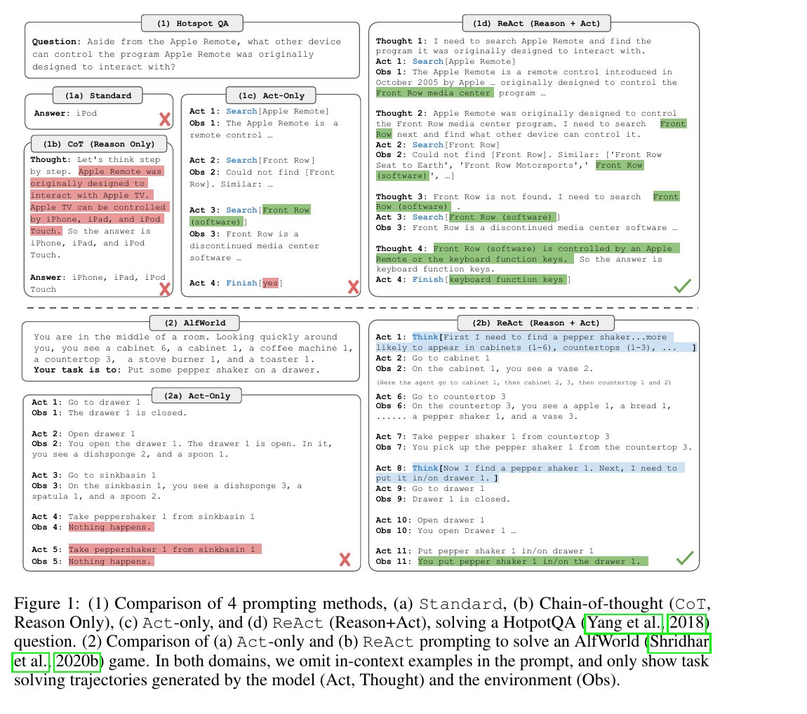
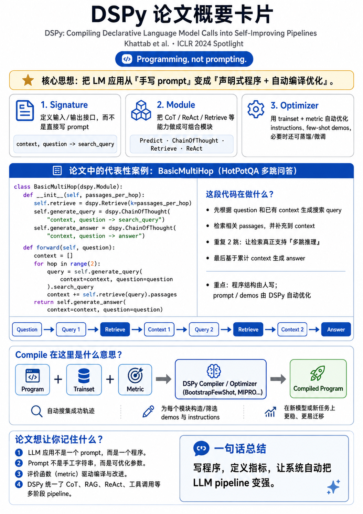

# 5月13日
## 阅读论文

概览查阅了解 [飞书文档Self-Evolving Agents for Scientific Research: Literature Review](https://complife-lab.feishu.cn/wiki/ViyowMCymiPhR2kOWLocs9Kmndc#outline) 领域架构，该文档基于行业综述[A Survey of Self-Evolving Agents](../../doc/papers/01_foundations/2026-01_Self-Evolving_Agents_Survey.pdf)，将self-evolving分为如下几个部分：

What to Evolve
When to Evolve
How to Evolve
Evaluation

- What to Evolve
  - Weight-Level
    - Full-Params
    - Partial-Params（LoRA Variations）
  - Prompt-Level
    - System Prompt / Persona Evolution
    - Instruction Optimization
  - Memory-Level
    - Episodic Memory
    - Semantic / Knowledge Memory
    - Hierarchical Memory
    - Skill Memory
  - Tool / Skill Level
    - Tool / Skill Creation
      - From Trajectory
      - From External Resources
      - From Exploration
    - Tool / Skill Composition & Assembly
    - Tool / Skill - Agent Co-Evolution
      - Skill + RL
      - Skill + Reasoning
  - Workflow / Architecture Level
    - Workflow Topology
      - Skill-chain Workflow
      - Routing / Dispatch-driven Workflow
      - DAG-based Workflow
        - Static DAG
        - Dynamic DAG（centralized / decentralized）
    - Skill Library Organization Level
      - Flat Library
      - Taxonomy / Hierarchy
      - Capability Tree
      - Skill Graph
- When to Evolve
  - Intra-Task
    - ICL
    - RL
  - Inter-Task
    - RL
    - SFT
    - ICL
- How to Evolve
  - Gradient-Based
    - SFT
      - Imitation / demonstration learning
      - Self-generated trajectory SFT
    - RL
      - Foundations（GRPO 系列变体）
      - Fine-grained rewards
      - Credit assignment
      - Reward distribution / hindsight / learned baseline
      - RLHF
      - Environment-feedback
      - AI-feedback
        - Internal / intrinsic signal
        - External（LLM-as-judge）
    - Distillation
      - Self-Distillation
      - Cross-Distillation
  - Gradient Free
    - Tree Search
    - Self-Play
    - Other test-time evolution
    - Experience-Driven Methods
      - Reflection & Self-Critique
      - Experience Distillation
      - Curiosity & Self-Questioning
  - Special Issue: Evolve with human-in-the-loop
- Evaluation
  - Benchmarks
    - General Agent Benchmarks
      - Agent Behavior
      - Agent Capability（Tool Use / Planning & Reasoning / Memory）
    - Scientific Agent Benchmarks
      - Domain-Specific Scientific Tasks
      - End-to-End Research Workflow
      - Scientific Discovery and Validation
  - Evolution-Specific Metrics

### 首先阅读 [ReAct_2022_10](../../doc/papers/01_foundations/2022-10_ReAct_Yao_Princeton.pdf) 定义了 LLM Agent 的基本范式 "Thought → Action → Observation" 循环

  

### 随后阅读[DSPy](../../doc/papers/01_foundations/2023-10_DSPy_Khattab_Stanford.pdf)

后继工作 [TextGrad, Nature](../../doc/papers/02_paradigm_openers/2024-06_TextGrad.pdf)