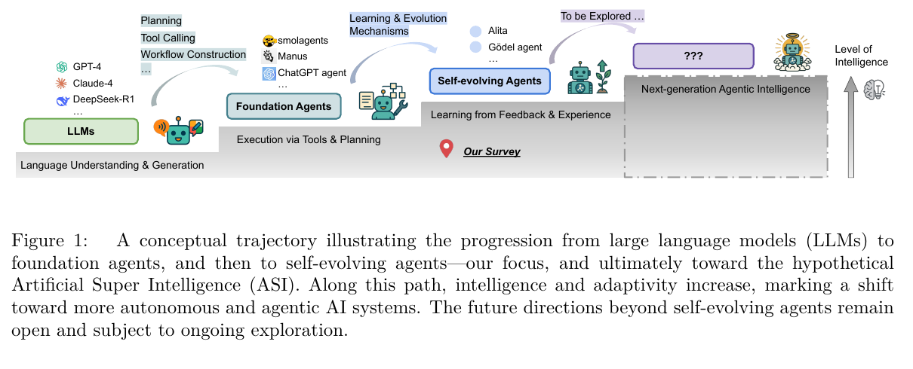
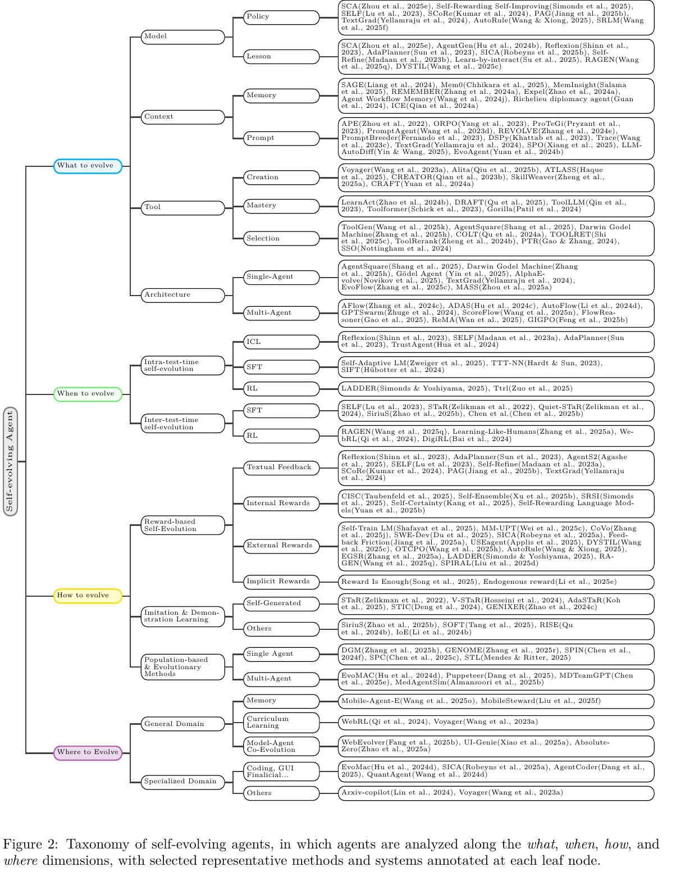
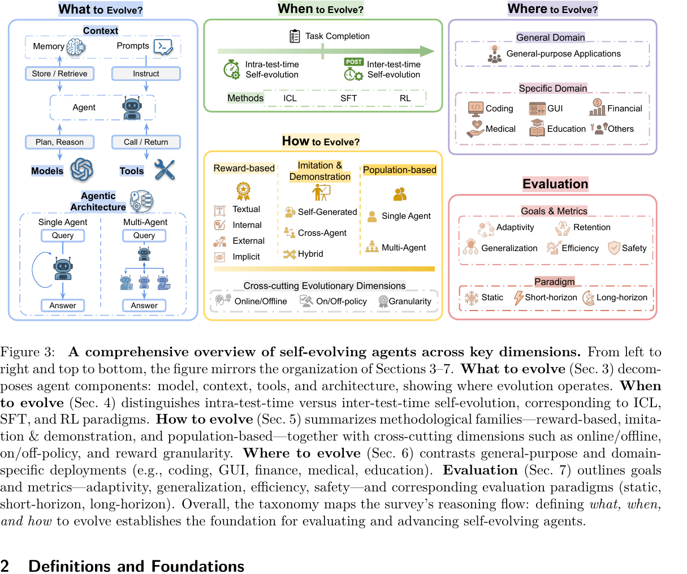
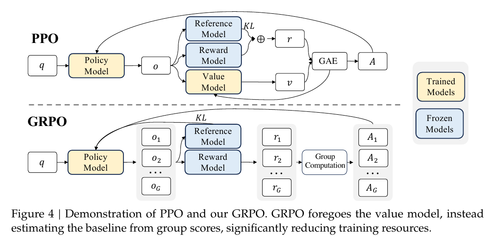
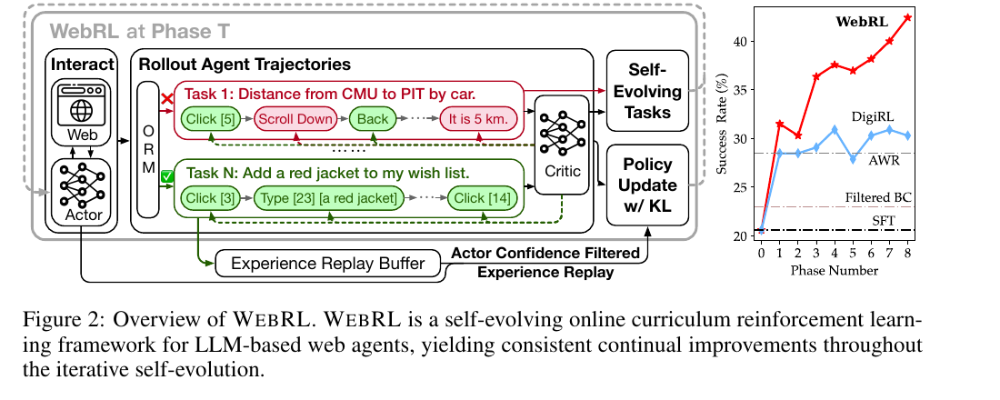
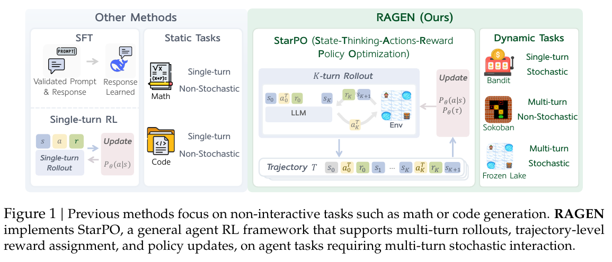
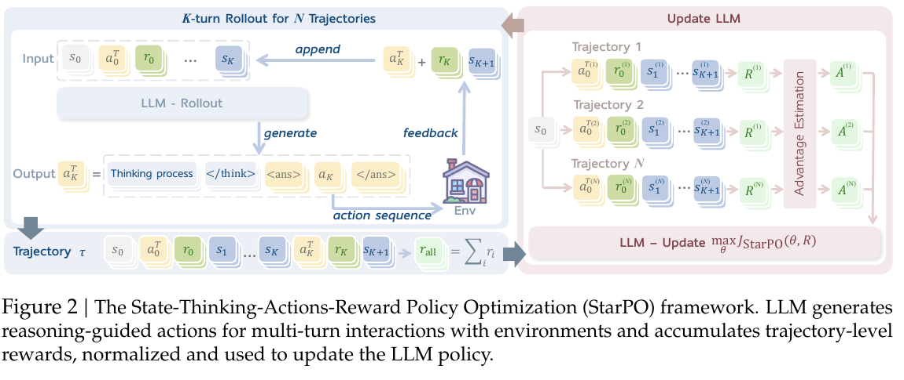
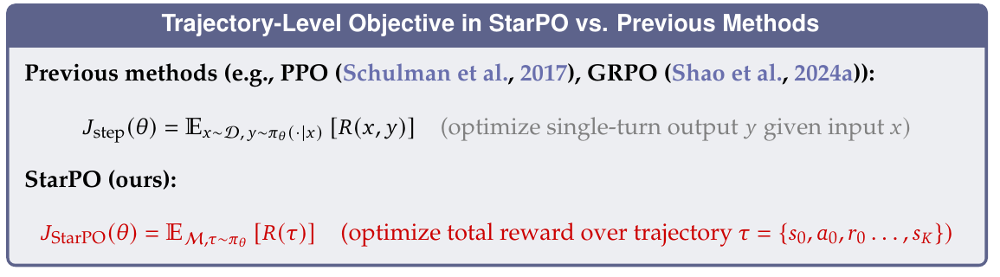
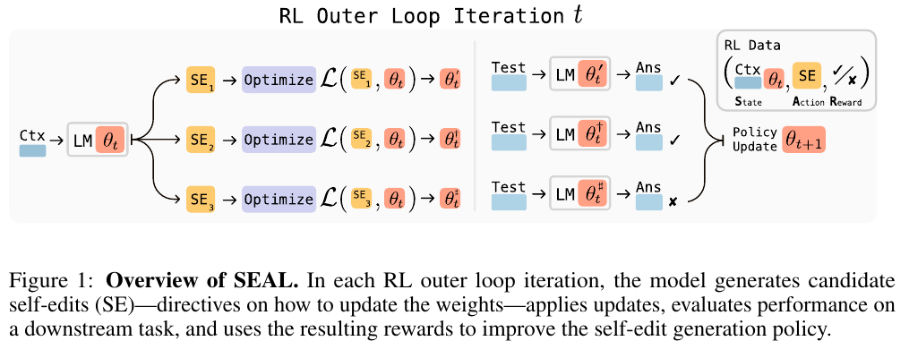
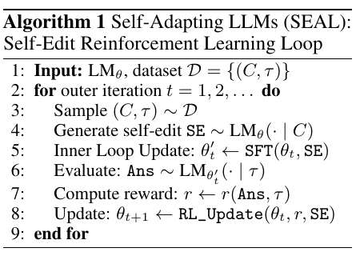

# 5月14日-16日

## 阅读基于权重的论文 Gradient-Based Reinforcement Learning(RL)

### 阅读 [A Survey of Self-Evolving Agents](../../doc/papers/01_foundations/2026-01_Self-Evolving_Agents_Survey.pdf)。

该综述将 self-evolving agents 定义为能够从新数据、交互和经验中持续学习的 agent 系统，区别于只依赖人工更新流程的静态 LLM 或普通 agent。文章的核心价值在于给出一个统一分析框架：What to Evolve、When to Evolve、How to Evolve，以及后续的 Where to Evolve / Evaluation。

Figure 1:

Figure 2:

Figure 3:

主要脉络：

- What to Evolve：关注 agent 的哪些部分可以进化，包括 model / policy、prompt、memory、tool、workflow / architecture 等。对应到当前阅读脉络，GRPO 属于 model / policy 层面的参数更新；DSPy、TextGrad、GEPA 更偏 prompt / program 层面；ReasoningBank、ACE 更偏 memory / context 层面。
- When to Evolve：区分 intra-test-time 和 inter-test-time。前者强调在单个任务执行过程中根据反馈调整策略，后者强调跨任务积累经验、更新记忆或模型，使下一次任务更强。
- How to Evolve：按反馈信号和优化方式组织，包括 scalar reward、textual feedback、self-reflection、bootstrapping、population-based search、多 agent 互学等。GRPO 是 scalar reward + RL 的代表，但综述也强调并非所有自进化都必须更新模型权重。
- Evaluation：传统 benchmark 只能评估静态性能，不足以评估持续学习能力。自进化 agent 还需要关注 adaptivity、robustness、sample efficiency、cost、safety、long-horizon performance 等指标。

阶段性理解：这篇综述更像领域地图，GRPO 是其中 How to Evolve 里 reward-based / gradient-based 的基础算法之一，但 self-evolving agents 的范围更大，还包括 prompt evolution、memory evolution、tool creation、workflow evolution 和 human-in-the-loop 等路线。后续读论文时可以用这篇综述作为索引：先判断论文在 What / When / How 中的位置，再看它解决的是哪类 evolution signal 或 agent component。

## Gradient-Based Reinforcement Learning(RL)

### 阅读 [GRPO / DeepSeekMath](../../doc/papers/01_foundations/2024-02_GRPO_DeepSeekMath.pdf)
重点关注 Group Relative Policy Optimization 的算法结构。GRPO 相比 PPO 去掉 value model，通过同一问题下多条 sampled outputs 的组内 reward 估计 baseline，从而降低训练资源开销。

### 阅读[DAPO](../../doc/papers/02_paradigm_openers/2025-03_DAPO_ByteDance.pdf)

DAPO 是字节在 GRPO 基础上、面向长链推理(long-CoT)RL 的开源工业级方案,通过四项对症改造解决 naive GRPO 的"熵塌缩、梯度退化、长度失控"三大病灶。

**(1) Clip-Higher**——把对称裁剪上下界拆开:

$$\text{clip}(r_{i,t}, 1-\varepsilon_{\text{low}}, 1+\varepsilon_{\text{high}}),\quad \varepsilon_{\text{low}}=0.2,\ \varepsilon_{\text{high}}=0.28$$

因为上界 $\pi_{\text{old}}(1+\varepsilon)$ 对低概率探索 token 太苛刻(0.01 只能涨到 0.012),放宽上界让探索 token 有空间,阻止熵塌缩。

**(2) Dynamic Sampling**——丢掉组内全对或全错的 prompt:

$$0 < |\{o_i \mid \text{is\_equivalent}(a, o_i)\}| < G$$

这类 prompt 经组归一化后 $\hat{A}_{i,t} \equiv 0$、贡献零梯度,过采样替换掉它们让每个 batch 都填满有效梯度。

**(3) Token-Level Loss**——把归约分母从"样本数"改成"总 token 数":

$$\frac{1}{\sum_{i}|o_i|}\sum_{i,t}(\cdot)\quad \text{替代}\quad \frac{1}{G}\sum_i \frac{1}{|o_i|}\sum_t(\cdot)$$

消除长回答里每个 token 被 $1/|o_i|$ 稀释的偏置,让关键长推理 token 拿到应得权重,也让 gibberish 按 token 数受罚。

**(4) Overlong Reward Shaping**——截断样本先 mask loss,再加软长度惩罚:进入危险区(长度 > $L_{\max}-L_{\text{cache}}$)线性递增扣分,超过硬上限才扣满 −1。把"长度违规"和"答案对错"两类 reward 信号解耦。

配合**去掉 KL 项**(长 CoT 需要分布大幅偏离 π_ref)和**规则化整数答案 reward**(规避 reward hacking)。最终把 Qwen2.5-32B base 在 AIME 2024 从 30 分推到 **50 分**,以一半训练步数反超 DeepSeek-R1-Zero-Qwen-32B(47 分),完整开源算法、verl 训练栈与 DAPO-Math-17K 数据集。

### 阅读[WebRL](../../doc/papers/02_paradigm_openers/2024-11_WebRL_THUDM.pdf)

WebRL 是一套自演化在线课程式 RL 框架,通过三项闭环创新解决 LLM web agent 训练的核心瓶颈:

- (1) 自演化 curriculum——从失败轨迹用 LLM 反生成难度自适应于 agent 能力边界的新任务,把"失败"变成"恰好够得着的练习";

- (2) 自训 ORM——用 8B LLM 做 YES/NO 判官替代稀疏环境奖励,准确率反超 GPT-4;

- (3) KL 约束 actor-critic + perplexity 中位回放——以强 KL 锚定参考策略、只复习"中等难度"成功经验,对抗课程学习的策略漂移与遗忘;

三者构成"失败出题—自动判卷—受控更新"的自给飞轮,将 Llama-3.1-8B 在 WebArena-Lite 从 4.8% 推到 42.4%,反超 GPT-4-Turbo (17.6%)。

### 阅读[RAGEN/StarPO](../../doc/papers/02_paradigm_openers/2025-04_RAGEN_StarPO.pdf)

RAGEN 是第一篇系统性研究"多轮 agent RL 训练动力学"的论文,揭示了 Echo Trap 这一独特失败模式,给出 StarPO-S(过滤 + 不对称裁剪 + 去 KL)作为稳定方案,并通过 6 个 Finding 把"什么样的设计才能让 LLM agent 学得稳"提炼成可操作的工程经验,但同时承认:agent RL 距离 SFT 性能还有显著差距,推理涌现需要更精细的 reward 设计。

把 GRPO/PPO 推广到多轮 agent,发现新问题(Echo Trap),提出新方案(StarPO-S)

Figure 1:

Figure 2:

Trajectory-Level Objective in StarPO vs. Previous Methods:

### 阅读[SEAL](../../doc/papers/02_paradigm_openers/2025-06_SEAL_MIT.pdf)

SEAL 让 LLM 通过 RL **学会写"给自己看的训练材料"**——模型生成 self-edit,用它 SFT 自己,再用下游表现当 reward 反过来优化"写 self-edit"的能力,实现真正的自我教学。

Figure 1:

Algorithm 1:

**1. Self-Edit 作为统一接口**
把"模型如何更新自己"抽象成一段**自然语言指令**——可以是改写的训练数据、超参指令、工具调用。一个文本生成接口涵盖所有更新方式,把权重更新变成可学习的生成任务。

**2. 双层优化:学习"如何教自己"**
内层用 SE 做 SFT 得到临时模型 $\theta'$,外层用 $\theta'$ 的下游表现作 reward 反向优化原模型生成 SE 的能力。学到的是**元能力**——"看到新东西时如何改写成最适合自己的训练材料",而非具体知识。

**3. ReST-EM 适配慢 reward**
Reward 需要"训完再评估"才能拿到,PPO/GRPO 不合适。改用拒绝采样 + SFT:只保留高 reward 的 SE 当模仿目标。简单、稳定、不需要 critic。

**4. 下游表现即 reward,完全自动**
不需要人工评价 SE 质量,直接用客观任务准确率做信号,实现真正闭环的自我教学。
