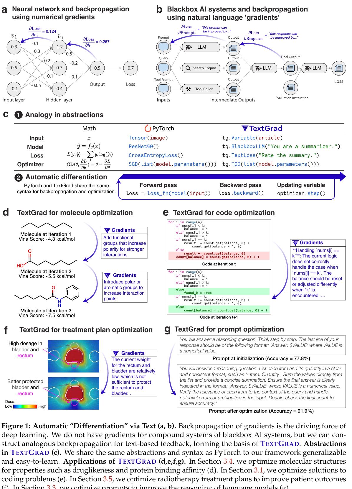
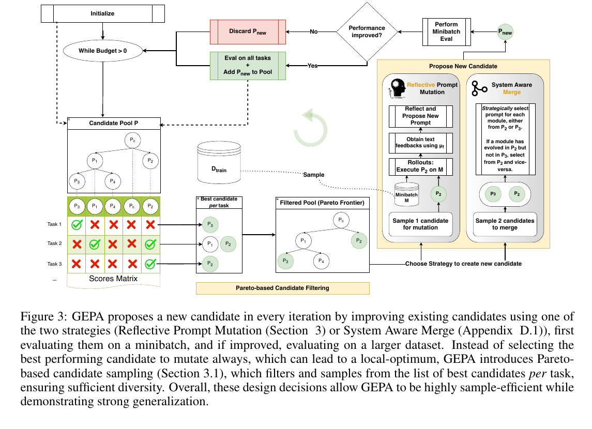
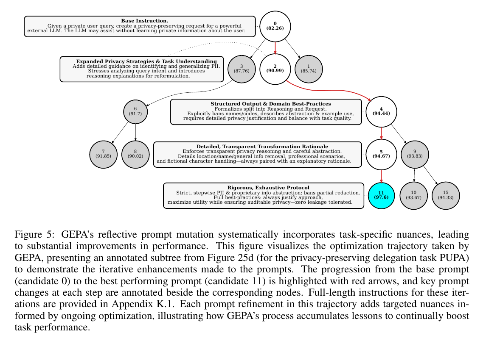
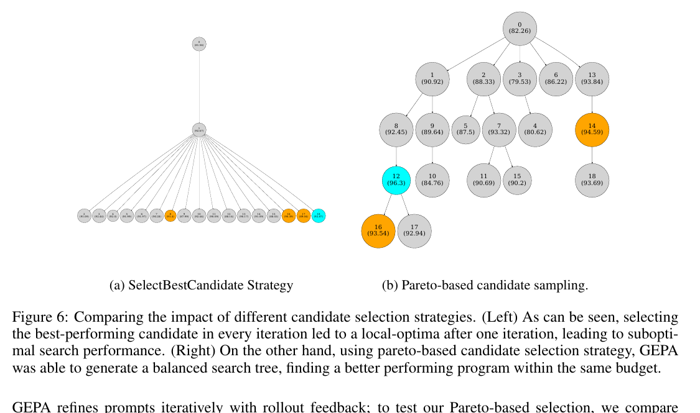
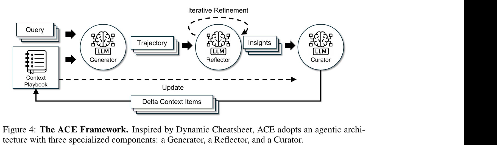

# 5月16日

## 阅读论文

### 阅读[DSPy](../../doc/papers/01_foundations/2023-10_DSPy_Khattab_Stanford.pdf)

### **DSPY** 后继工作 [TextGrad, Nature](../../doc/papers/02_paradigm_openers/2024-06_TextGrad.pdf)

**TextGrad 把反向传播从数值推广到自然语言**——用 LLM 生成的批评反馈当"梯度"，沿计算图反传，以 PyTorch 同构的 API 优化任何文本变量（prompt、代码、分子、放疗参数等）。

**与 DSPy 互补**：DSPy 是 LM Pipeline 的"编译器"（优化整体结构和 demonstrations），TextGrad 是 LM Pipeline 的"autograd"（优化单个变量内容），且首次系统化支持 Instance Optimization——把代码、分子结构本身当变量优化，在跨工具、非可微的科学任务上拿到 SOTA。

Figure 1:

### 阅读[GEPA](../../doc/papers/03_current_sota/2025-07_GEPA_Reflective_Prompt_Evolution.pdf)
#### GEPA 核心技术要点

**定位：** 用"语言反思 + 进化 + Pareto"代替 RL，做 LLM 复合系统的 prompt 优化。比 GRPO 高 10–20%、样本少 **35×**；比 MIPROv2 高 14%。

Figure 3:

#### 三大核心技术

**① 反思式变异**
把执行 trace + 文本反馈喂给反思 LLM，让它做 credit assignment 后直接重写 prompt。引入 **Feedback Function μ_f**——评估器不只返回分数，还返回自然语言诊断（编译错误、模块级反馈等）。

Figure 5:

**② Pareto 候选选择**
不选"全局最优"演化（会陷局部最优），而是维护**实例级 Pareto 前沿**——保留所有"至少在一条任务上最优"的候选，加权随机抽样。借鉴 MAP-Elites 的多样性照亮思想。

Figure 6:

**③ 遗传进化 + Merge**
候选池迭代演化、追踪祖先。Merge 把两条谱系各自学好的不同模块拼成新候选——一种系统感知的 crossover。

#### 核心论点

LLM 最擅长读自然语言。把 rollout 压成标量再算策略梯度，是浪费 LLM 的语言先验——**应该让 LLM 直接读 trace 反思**。

### 阅读[ACE](../../doc/papers/03_current_sota/2025-10_ACE_Agentic_Context_Engineering.pdf)

#### ACE 核心技术要点

**定位：** 把 Context Adaptation 从"优化一段 prompt"重新定义为"维护一本会自我生长的领域 playbook"——直接针对 GEPA 的简洁性偏差和 Dynamic Cheatsheet 的上下文坍塌。

Figure 4:

#### 三大核心技术

**① 三角色分工**（解耦"执行"与"记忆"）
- **Generator**：用当前 playbook 解题，产 trace
- **Reflector**：诊断 trace，提炼可复用 insight，给现有 bullets 打 helpful/harmful 标签
- **Curator**：把 insight 转成结构化 ADD 操作，**用非 LLM 逻辑确定性合并**——这是不坍塌的关键

**② 结构化 Bullets + Delta 更新**
上下文不是字符串，而是 bullets 集合，每条带 ID + helpful/harmful 计数。每轮只产小批 delta 补丁、局部合并，不重写整体。可并行合并。

**③ Grow-and-Refine**
新 ID 追加、旧 ID 就地更新计数；用语义嵌入定期去重剪枝。主动或惰性触发。
