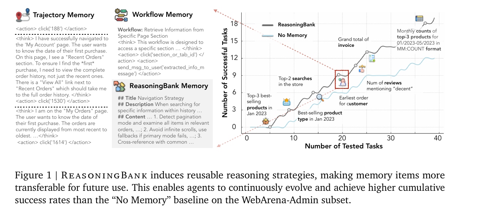
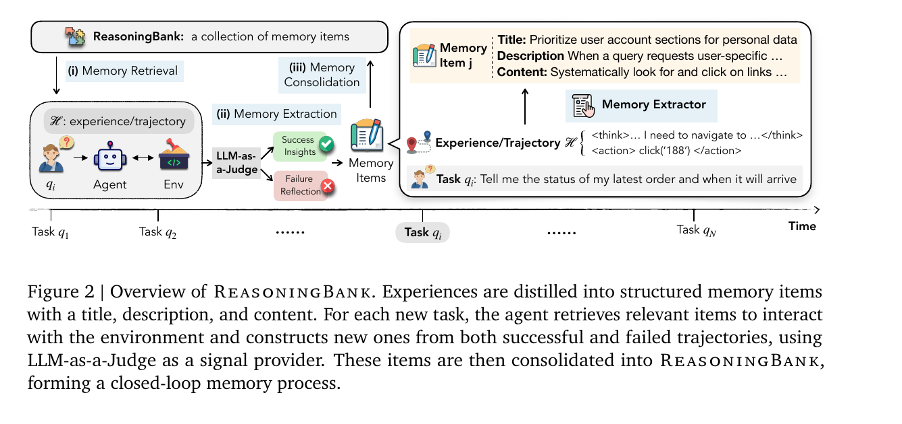
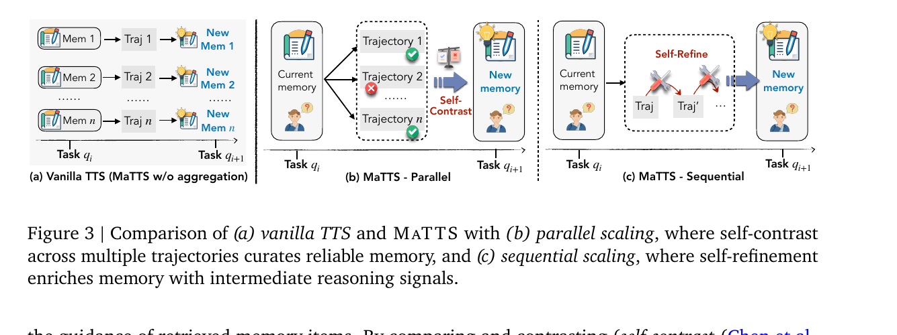
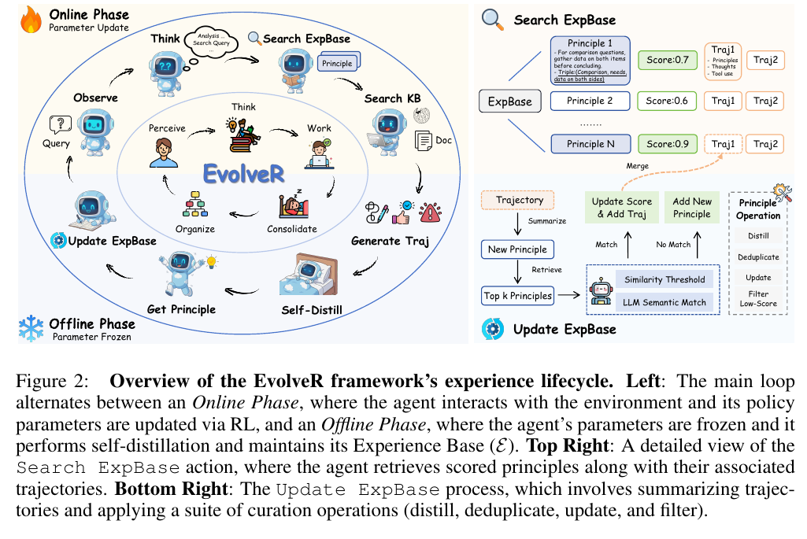
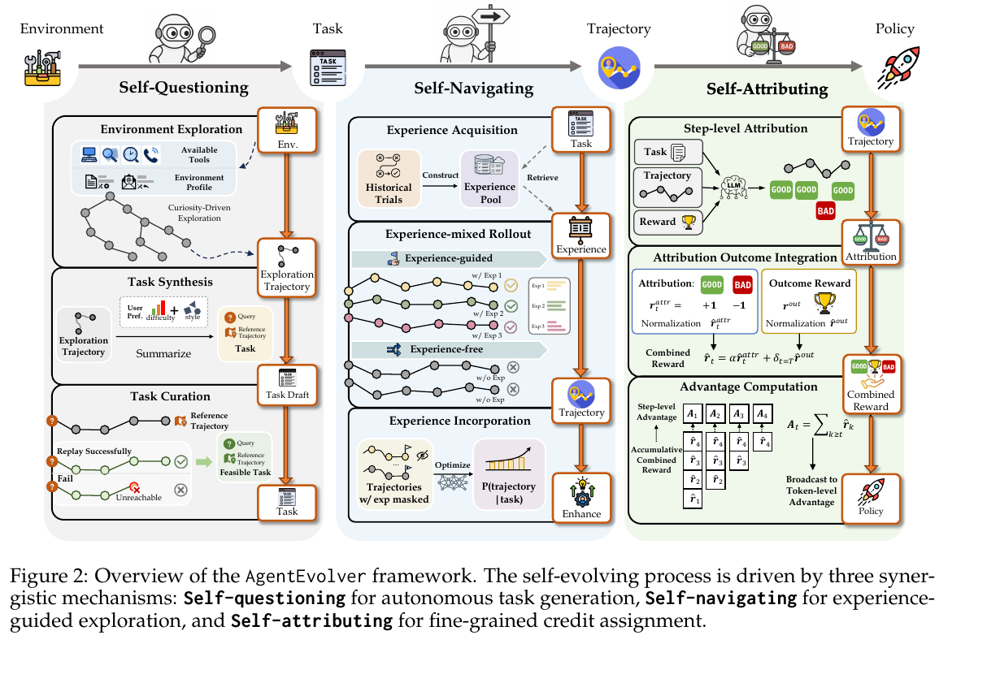
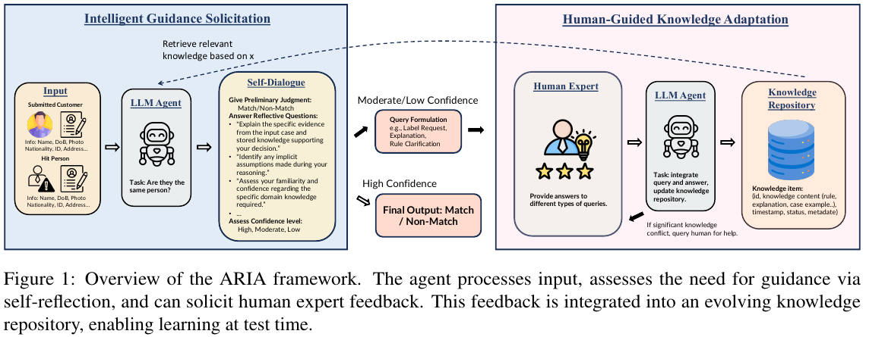
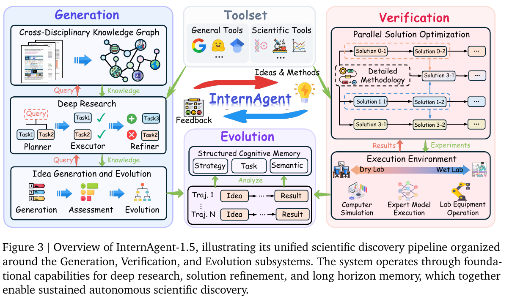

# 5月17日-18日

## 阅读论文，Memory + RL/Context 闭环

### [SEAL](../../doc/papers/02_paradigm_openers/2025-06_SEAL_MIT.pdf)已读过

### [ReasoningBank](../../doc/papers/03_current_sota/2025-09_ReasoningBank.pdf)（不动权重）
### ReasoningBank 技术核心

Figure 1:

**问题**:Test-time learning,任务流式到达,无 ground truth,agent 策略 $\pi_\mathcal{L}(\cdot|\mathcal{M},\mathcal{A})$ 依赖记忆 $\mathcal{M}$。

**记忆 Schema**:`{title, description, content}`,抽象层级在 raw trajectory(Synapse)和 procedural workflow(AWM)之上,存 strategy/reasoning pattern。

**闭环 pipeline**:
1. **Retrieval**:query embedding + cosine 相似度,top-k 拼入 system prompt
2. **Construction**:LLM-as-a-Judge 二元判定成败 → 成功提炼策略 / 失败提炼 counterfactual pitfall,每轨迹最多 3 条
3. **Consolidation**:直接 append

Figure 2:

**MaTTS**:scaling factor $k$
- **Parallel**:$k$ 条轨迹 self-contrast,过滤 spurious solution
- **Sequential**:单轨迹 $k$ 步 self-refinement,中间 notes 也入库
- 关键是利用 contrastive signal,而非 vanilla TTS 独立处理

Figure 3:

### [EvolveR](../../doc/papers/06_rl_variants/2025-10_EvolveR.pdf)

#### EvolveR 核心技术

**架构**:双存储——经验库 $\mathcal{E}$(向量库,存策略原则)+ 模型权重 $\theta$(GRPO 训练)。

**经验原则**:自然语言描述 + 结构化三元组,从成功蒸馏指导原则、从失败蒸馏警示原则,用拉普拉斯平滑打分 $s(p)=\frac{c_{succ}+1}{c_{use}+2}$,低分剪枝。

**双检索动作空间**:`<search_experience>`(查策略)+ `<search_knowledge>`(查事实)+ `<answer>`。

**闭环生命周期**:EvolveR 的循环周期是，在线交互中检索经验原则来完成任务并产生新轨迹 → 离线冻结模型把成功/失败轨迹自蒸馏成可复用原则并去重维护经验库 → 用这些经验引导的新轨迹通过 GRPO 更新策略 → 更新后的 agent 再进入下一轮在线交互。

Figure 2:

**关键设计**:训练时 `<experience>` token 的 loss 被 mask——权重学的是"**如何使用记忆**",不是记忆内容本身。

**奖励**:Outcome(EM 精确匹配)+ Format(推理结构合理性)的加权和。

**核心发现**:3B 起,**自蒸馏 > GPT-4o-mini 教师蒸馏**——cognitive alignment 让模型"听得懂自己说的话"。

### [AgentEvolver](../../doc/papers/06_rl_variants/2025-11_AgentEvolver.pdf)

Figure 2:

**核心**:零数据新环境,agent 自动出题、自动练、自动复盘,端到端自我进化。

**三大机制**:

**Self-Questioning(自动出题)**
高温度 LLM 在环境里探索,从已走通的轨迹**反推任务和参考解**——保证有解、可验证。LLM Judge 对照参考解打分,把开放评判收紧为可比对任务(无参考解 22.5% → 有参考解 44.3%)。

**Self-Navigating(经验导航)**
经验本结构:`When to use` + `Content`,向量库检索。混合 rollout($\eta=0.5$ 一半带经验一半 vanilla)。两个关键技巧:
- **Experience Stripping**:训练时删掉经验 token,逼模型内化"会用"而非"背诵"
- **Selective Boosting**:Stripping 引发 off-policy 失稳,对正优势的经验样本放宽 PPO 上裁剪($\hat\epsilon_{\text{high}}=0.6$),好样本梯度多走一步

**Self-Attributing(步级复盘)**
LLM 对轨迹每步打 **GOOD/BAD** 二元标签,量化为 $\pm 1$。轨迹级归一化(不是 step 级,避免长轨迹主导)。与 outcome 奖励**独立归一化后融合**:$\hat r_t = \alpha\cdot\hat r_t^{\text{attr}} + \mathbf{1}_{t=T}\cdot\hat r^{\text{out}}$。稀疏轨迹奖励变稠密步级信号。

## 产业部署
### [ARIA](../../doc/papers/04_industry_hitl/2025-07_ARIA_TikTok.pdf)

Figure 1:

#### 核心思路
**自我反思 + 人类在环 + 演化知识库**

#### 两大模块

**1. 智能引导请求IGS(何时问人)**
- 结构化自对话评估置信度(High/Moderate/Low)
- 仅在不确定时触发人工查询,节省预算

**2. 人类引导知识适应 HGKA(如何存知识)**
- 知识项带时间戳和状态(Valid/Outdated/Superseded)
- 新知识入库时,语义检索旧知识 → LLM 对比 → 自动标记冲突
- 检索时按"有效性 × 新近度 × 相关性"加权

## 关键结果
- TikTok Pay:人工 12 分钟/案 → **0.23 分钟/案**,准确率全面超越 RAG、Reflexion、主动学习
- CUAD 法律数据:准确率 0.49 → 0.64

## 一句话
**让智能体"知道自己不知道",主动问人,并把答案结构化、带时间戳地存起来。**

## for Science

### [InternAgent-1.5 / NovelSeek](../../doc/papers/05_scientific_grounding/2026-02_InternAgent_1_5_NovelSeek.pdf)

上海 AI 实验室推出的**统一 AI 科学家框架**,支持端到端自主科研,覆盖计算实验(算法发现)和实物实验(湿实验)。

Figure 3:

#### 核心架构:3 子系统 + 3 基础能力

| 子系统 | 职责 | 基础能力 |
|--------|------|---------|
| **Generation 生成** | 提假设、做规划 | Deep Research(深度文献研究) |
| **Verification 验证** | 跑实验、评方法 | MLEvolve(方案迭代优化) |
| **Evolution 演化** | 跨周期改进 | Long-Horizon Memory(持久记忆) |

## 关键创新
- **跨学科知识图谱 + 流图**:结构化推理,避免幻觉
- **生成式+并行实验设计**:不是从固定空间挑,而是 LLM 生成新方案,多路并行
- **持久化记忆**:跨会话不失忆,避免重复犯错
