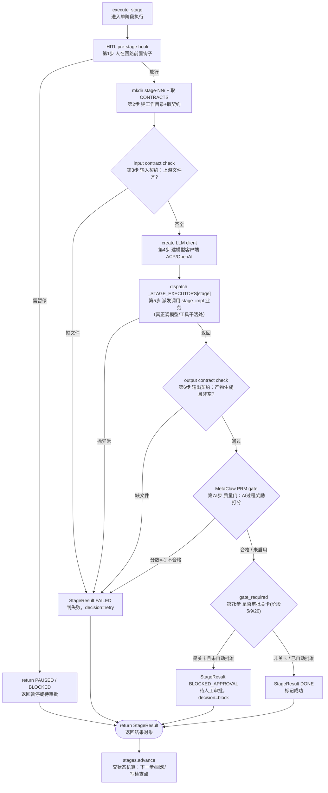

## repo

### 下一步阅读目标

#### [The AI Scientist](https://github.com/SakanaAI/AI-Scientist)

- Group: Hand-Crafted Agent Research System
- Core Design: Work Flow Design
- General Purpose: Y
- Self-Evolving: N
- Article: https://arxiv.org/abs/2408.06292
- 介绍:
  1. Template-driven research framework，以 `templates/` 作为核心 research unit。
  2. `launch_scientist.py` 作为整个 workflow 的 unified entry point。
  3. 运行完整 pipeline：idea、experiment、plot、paper、review。
  4. template contracts 和 automated research pipelines。

#### [AutoResearchClaw](https://github.com/aiming-lab/AutoResearchClaw.git)

- Group: Claw-Based Research System
- Core Design: Skills, Human-in-the-loop
- General Purpose: Y
- Self-Evolving: Skill
- Article: http://N/A
- 介绍:
  - 实现了 skills evolving, i.e., 通过 MetaClaw 的做法，把失败经验提炼成 skills，注入后续 run，实现跨运行学习。
  - human-in-the-loop：支持从全自动到 co-pilot 的多种介入模式，把人正式纳入 pipeline，而不是只是事后 reviewer。
  - 带有完整的 research quality control，如 citation verification, anti-fabrication, sandbox execution, quality gates.

#### [SkillNet](https://github.com/zjunlp/SkillNet)

- Group: Skill Libs
- Core Design: Skills
- General Purpose: Y
- Self-Evolving: Skill（自动化创建 pipeline + 多阶段筛选使技能库自我生长）
- Article: https://arxiv.org/abs/2603.04448
- 介绍:
  1. **五维 skill 质量评估框架**：提出 Safety / Completeness / Executability / Maintainability / Cost-awareness 五维，LLM judge + sandbox 实测脚本可运行性；200 样本人类盲评与 PhD 标注员几乎完全一致（QWK≈1.0）。突破了 SkillsMP / SkillHub 等仅靠 GitHub stars 或社区投票的现状。
  2. **Skill Ontology + 四类关系边**：不把 skill 当孤立条目，而是建图——similar_to / belong_to / compose_with / depend_on，使 agent 能做 workflow 合成、依赖追踪、冗余检测，而非只是"搜到一个 skill"。
  3. **自动化 skill 创建 pipeline**：从 trajectory、GitHub repo、PDF/PPT/Word、NL prompt 四种异构源自动提炼 skill，配多阶段筛选（识别去重 → 内容生成 → 校验重试 → 评估 → 关系入库），技能库可自我生长而非被动接收人工提交。

#### [MedgeClaw](https://github.com/xjtulyc/MedgeClaw)

- Group: Skill Libs
- Core Design: Skills
- General Purpose: N
- Self-Evolving: N
- Article: http://N/A
- 介绍:
  1. Biomedical skill ecosystem
  2. 140 K-Dense scientific skills
  3. 涵盖 genomics、drug discovery、clinical research、ML
  4. 包含 domain-specific 的 biomedical skill chains

#### [Auto-claude-code-research-in-sleep](https://github.com/wanshuiyin/Auto-claude-code-research-in-sleep)

- Group: Skill Libs
- Core Design: Skills
- General Purpose: Y
- Self-Evolving: N
- Article: http://N/A
- 介绍:
  - 内容只有 Markdown-only skills，通过设计对应不同科研阶段的 skills 来搭建一个科研流水线。适用于任何 Agent 平台。
  - 无 Evolving 过程

#### [AI-Research-SKILLs](https://github.com/Orchestra-Research/AI-research-SKILLs)

- Group: Skill Libs
- Core Design: Skills
- General Purpose: Y
- Self-Evolving: N
- Article: http://N/A
- 介绍:
  1. 87 skills，覆盖 22 个 AI research categories
  2. 涵盖 autoresearch、ideation、ML paper writing、training、evaluation、agents、RAG、multimodal、MLOps
  3. 混合了 workflow-level 和 tool/framework-level 的 skills
  4. 作为 AI research skill taxonomy 和基于类别组织方式的参考具有价值

## 部署/阅读

### ai-scientist

本地路径：[reference-repos/repos/ai-scientist](../../reference-repos/repos/ai-scientist)

#### 目录结构

```
ai-scientist/
├── launch_scientist.py        # 主编排入口（流水线总控）
├── ai_scientist/              # 核心库（5 个模块）
│   ├── llm.py                 # 统一的多 LLM 后端抽象层
│   ├── generate_ideas.py      # 阶段1: 构思 + 文献查新
│   ├── perform_experiments.py # 阶段2: 自动实验执行
│   ├── perform_writeup.py     # 阶段3: LaTeX 论文撰写 + 引文
│   └── perform_review.py      # 阶段4: 自动同行评审 + 改进
├── templates/                 # 研究模板（每个=一个领域的起点代码）
│   ├── nanoGPT/  grokking/  2d_diffusion/  seir/  MACE/ ...
├── experimental/              # 开放式（open-ended）变体
├── example_papers/            # 已生成的样例论文 + 完整产物
├── review_ai_scientist/       # 评审器在自身论文上的实验数据
└── review_iclr_bench/         # 评审器在 ICLR 真实论文上的基准
```

每个 template 是自包含可运行实验包，约定接口：`experiment.py`（基线代码，约定 `python experiment.py --out_dir=run_i`，结果写 `final_info.json`）、`plot.py`、`prompt.json`、`seed_ideas.json`、`latex/template.tex`、`run_0/final_info.json`（预跑基线）。

#### 总览图

```
launch_scientist.py --experiment nanoGPT --model claude-3-5-sonnet --num-ideas 50
        │
        ▼
┌─────────────────────────────────────────────────────────────────┐
│  阶段 0：初始化（一次性，全局）                                       │
│  create_client() → 选模板 templates/nanoGPT/                       │
└─────────────────────────────────────────────────────────────────┘
        │
        ▼
┌─── 阶段 1：构思 generate_ideas() ────────────────────────────────┐
│  seed_ideas.json + experiment.py + prompt.json                    │
│  循环 num-ideas 次：                                               │
│    生成1个想法 → 反思精炼×(NUM_REFLECTIONS-1) → "I am done"收敛     │
│  产出：ideas.json（结构化想法档案，累积去重）                         │
└──────────────────────────────────────────────────────────────────┘
        │
        ▼
┌─── 阶段 2：文献查新 check_idea_novelty() ───────────────────────┐
│  逐个想法，最多 10 轮：                                             │
│    LLM 出搜索query → Semantic Scholar/OpenAlex → 摘要回灌          │
│    → "Decision made: novel / not novel"                            │
│  产出：每个想法打上 novel=True/False                                │
└──────────────────────────────────────────────────────────────────┘
        │
        ▼  过滤 novel==True
┌─── 对每个 novel 想法：do_idea()（串行 or 按GPU并行）───────────────┐
│                                                                    │
│  ① 沙箱：copytree 模板 → results/<时间戳>_<想法名>/                  │
│     写 notes.txt（标题/描述/baseline）                              │
│                                                                    │
│  ② 阶段3 实验 perform_experiments()                                │
│     循环（≤5 runs，每run≤4次重试）：                                 │
│       Aider 改 experiment.py                                       │
│       → python experiment.py --out_dir=run_i (subprocess)          │
│       → 成功:结果回灌LLM / 失败:stderr回灌LLM 自修复                 │
│       → "ALL_COMPLETED" 提前结束                                    │
│     收尾：Aider 改 plot.py → 跑出图 → 把图说明写进 notes.txt        │
│                                                                    │
│  ③ 阶段4 写作 perform_writeup()                                    │
│     逐节写(Abstract→...→Conclusion)，每节写完即精炼                  │
│     → Related Work 占位 → 引文循环(≤20轮:查文献→注入真bibtex→插\cite)│
│     → 全文二次精炼 → generate_latex()(净化+chktex+pdflatex) → PDF   │
│                                                                    │
│  ④ 阶段5 评审 perform_review()（固定 gpt-4o）                        │
│     PDF→markdown → 5路集成评审 → meta-review聚合 → review.txt       │
│                                                                    │
│  ⑤ 阶段6 改进（可选 --improvement）                                  │
│     按评审改论文 → 重新生成PDF → 再评审一次 → review_improved.txt    │
│                                                                    │
└──────────────────────────────────────────────────────────────────┘
        │
        ▼
   results/nanoGPT/<时间戳>_<想法名>/  含：论文PDF、代码、图、notes、review
```

### autoresearchclaw

本地路径：[reference-repos/repos/autoresearchclaw](../../reference-repos/repos/autoresearchclaw)

#### 整体设计思想

全自动科研论文流水线：输入一个研究课题，输出会议级 LaTeX 论文（含真实引用、沙箱实验、统计分析、多智能体评审）。约 7.1 万行 Python，核心包 `researchclaw/`。三条主线原则：

1. **声明式状态机驱动**：23 阶段的顺序、状态转移、Gate 审批、回滚规则全部声明式定义，与业务逻辑解耦（`stages.py`）。
2. **契约式执行**：每阶段声明输入/输出文件、完成定义（DoD）、错误码、重试次数，执行器据此自动校验（`contracts.py`）。
3. **可插拔适配器**：LLM、消息、记忆、Web、沙箱全部通过 Protocol 接口注入，便于测试与跨平台。

#### 代码分层（四层调用栈）

```
cli.py  (入口/参数/预检)
   └─▶ pipeline/runner.py  execute_pipeline()      ← 全流程主循环 + 横切逻辑
          └─▶ pipeline/executor.py  execute_stage()  ← 单阶段：契约校验 + Gate + PRM
                 └─▶ pipeline/stage_impls/_*.py       ← 23 个阶段的具体业务
                        └─▶ 子系统  (llm / literature / experiment / agents / hitl ...)
                 ↕
          stages.py  advance()    ← 声明式状态机（决定下一步）
          contracts.py CONTRACTS  ← 每阶段 I/O 契约（用于校验）
```

职责单一：cli 管配置/预检/目录；runner 管多阶段编排+断点+回滚递归+打包；executor 管单阶段契约/Gate/质量门；stage_impls 才真正调 LLM/工具；stages/contracts 是被查询的声明式数据。

#### 模块全景（按子系统）

| 子系统 | 关键模块与职责 |
|---|---|
| **pipeline/**（中枢）| `stages`(状态机) · `contracts`(I/O 契约) · `runner`(主循环) · `executor`(单阶段) · `stage_impls/_*`(23 阶段业务) · `experiment_diagnosis`+`experiment_repair`(自愈) · `paper_verifier`+`verified_registry`(数值防造假) · `opencode_bridge`(复杂代码路由) |
| **llm/** | `client`(OpenAI 兼容) · `acp_client`(跨 CLI Agent) · `anthropic_adapter` · `gemini_adapter` |
| **literature/** | `arxiv/openalex/semantic_scholar` 三源客户端 · `search`(去重) · `novelty`(查重) · `verify`(4 层引用核验) |
| **experiment/** | `sandbox`/`docker`/`ssh`/`colab`/`agentic` 沙箱 · `factory` · `code_agent` · `runner`(edit→run→eval) · `validator` · `metrics` |
| **agents/** | `code_searcher`(GitHub 检索) · `benchmark_agent`(基准 4 子 Agent) · `figure_agent`(配图 8 子 Agent) |
| **hitl/** | 6 种干预模式 · `smart_pause` · `claim_verifier` · `cost_guard` · `branching` · `adapters`(cli/ws/mcp/scripted) · `tui` · `workshops`(idea/baseline/paper) |
| **domains/** | `detector` · `prompt_adapter` · 10 个领域适配器(ml/bio/chem/physics/math/...) |
| **memory/+knowledge/+metaclaw_bridge/** | 实验/创意/写作记忆 · 知识图谱 · 失败教训→skill 跨运行学习 · PRM 质量门 |
| **skills/** | `schema`/`loader`/`registry`/`matcher` + 19 内置 skill |
| **templates/+overleaf/** | 会议模板 · MD→LaTeX · 编译自修复 · Overleaf 双向同步 |
| **辅助** | `assessor`(质量评分) · `server`(FastAPI/WS) · `servers`(SLURM/SSH/Cloud) · `copilot` · `project` · `trends` · `web` · `mcp` · `dashboard` · `collaboration` · `calendar` · `voice` · `wizard` |

> 节点采用「英文代码标识 / 中文说明」并行，方便对照源码。

#### 图 1 · 总体执行流（cli → runner）

```mermaid
flowchart TD
    A["researchclaw run --topic<br/>用户执行命令"] --> B["cmd_run<br/>解析 config.arc.yaml 配置"]
    B --> C{"project.mode<br/>运行模式判断"}
    C -->|"full-auto / --auto-approve<br/>全自动"| C1["auto_approve=True<br/>关卡自动批准，不停下"]
    C -->|"semi-auto<br/>半自动"| C2["stop_on_gate=True<br/>遇关卡暂停等批准"]
    C1 & C2 --> D["LLM preflight<br/>模型连通性预检"]
    D -->|"失败"| DX["exit 1<br/>立即退出报错"]
    D -->|"成功"| E["生成 run_id<br/>= rc-时间戳-课题哈希"]

    E --> F{"--resume / --from-stage<br/>是否断点续跑"}
    F -->|"是"| F1["按课题哈希反查目录<br/>读 checkpoint.json 恢复"]
    F -->|"否"| F2["新建 artifacts/run_id/<br/>空运行目录"]
    F1 & F2 --> G["装配 AdapterBundle + HITL<br/>外部依赖适配器 + 人在回路会话"]

    G --> H["execute_pipeline<br/>进入流水线主循环"]
    H --> I["init EventLog / ExperimentMemory / CostTracker<br/>事件日志 / 实验记忆 / 成本追踪"]
    I --> J{"遍历 STAGE_SEQUENCE<br/>从 from_stage 起逐阶段"}

    J --> K{"cancel? over-budget?<br/>被取消 / 超预算?"}
    K -->|"是"| KX["break<br/>跳出，进收尾"]
    K -->|"否"| L["execute_stage<br/>执行单个阶段（见图2）"]
    L --> M["织入横切处理<br/>EventLog / Spec校验 / Pitfall检测 / 实验记忆"]
    M --> N{"result.status<br/>本阶段结果"}

    N -->|"DONE 成功"| O["原子写 checkpoint.json<br/>+ 写知识库 / heartbeat"]
    N -->|"FAILED 失败"| P{"noncritical & skip?<br/>非关键且可跳过?"}
    P -->|"是"| O
    P -->|"否"| PX["break 中断"]
    N -->|"PAUSED / REJECTED<br/>暂停 / 人工驳回"| PX
    N -->|"BLOCKED & stop_on_gate<br/>卡审批且半自动"| PX

    O --> Q{"stage == RESULT_ANALYSIS<br/>且 repair.enabled<br/>第14阶段且开启实验修复"}
    Q -->|"是"| Q1["实验诊断 → 若 repair_needed<br/>进入修复重跑闭环"]
    Q -->|"否"| R
    Q1 --> R{"stage == RESEARCH_DECISION<br/>且 decision ∈ pivot/refine<br/>第15阶段且需回退"}

    R -->|"是, pivot_count<2<br/>回退未满2次"| R1["版本化旧 stage 目录<br/>递归 execute_pipeline<br/>from_stage=回退目标"]
    R1 --> R2["promote_best_stage14 → break<br/>取历史最优实验数据，递归层接管"]
    R -->|"否 / 超2次"| S["forced PROCEED<br/>强制带警告继续"]
    R2 --> T
    S --> T{"到达 to_stage?<br/>指定终止阶段?"}
    T -->|"是"| TX["break"]
    T -->|"否"| J

    KX & PX & TX & T --> U["write pipeline_summary.json<br/>汇总运行总结"]
    U --> V["Evolution 抽取教训<br/>→ evolution/ 目录"]
    V --> W["MetaClaw<br/>高危教训转可复用 skill"]
    W --> X["package_deliverables<br/>打包产物 → deliverables/"]
    X --> Y["HITL session finalize<br/>结束人在回路会话"]
    Y --> Z(["返回 results<br/>运行完成"])
```



逐步解读：读配置 → 判模式 → LLM 预检（防跑到一半才报错）→ 决定新开或续跑 → 主循环逐阶段执行，成功即原子写检查点（可恢复）；第14阶段后挂**实验自愈闭环**，第15阶段后挂**研究决策回退递归**（最多2次防死循环）；循环结束统一做总结、经验沉淀、产物打包。

#### 图 2 · 单阶段执行细节（execute_stage 的 7 步管线）



逐步解读：① 问人在回路要否插手 → ② 建目录取契约 → ③ **进门检查**上游文件 → ④ 建模型客户端 → ⑤ **派发干活**（按阶段号查表调对应业务）→ ⑥ **出门检查**产物 → ⑦ AI质量门 + 是否审批关卡。任一步不过都归为「失败可重试」，由外层主循环（图1）处理。

#### 图 3 · 23 阶段状态机（Phase 阶段组 / GATE 关卡 / 回滚）

红框菱形=审批关卡（被驳回往回退）；虚线=回退/返工路径。

```mermaid
flowchart TD
    A2 --> B1
    subgraph A["Phase A 立题"]
      A1["1 TOPIC_INIT<br/>课题初始化 → goal.md"] --> A2["2 PROBLEM_DECOMPOSE<br/>问题分解 → problem_tree.md"]
    end
    subgraph B["Phase B 文献调研"]
      B1["3 SEARCH_STRATEGY<br/>制定检索策略"] --> B2["4 LITERATURE_COLLECT<br/>收集文献 → candidates.jsonl"]
      B2 --> B3{"5 LITERATURE_SCREEN<br/>文献筛选 ★GATE"}
      B3 --> B4["6 KNOWLEDGE_EXTRACT<br/>知识抽取"]
    end
    B3 -. "REJECT 驳回：重收集" .-> B2
    B4 --> C1
    subgraph C["Phase C 知识综合"]
      C1["7 SYNTHESIS<br/>知识综合/找空白"] --> C2["8 HYPOTHESIS_GEN<br/>生成研究假设"]
    end
    C2 --> D1
    subgraph D["Phase D 实验设计"]
      D1{"9 EXPERIMENT_DESIGN<br/>实验设计 ★GATE"} --> D2["10 CODE_GENERATION<br/>生成实验代码"]
      D2 --> D3["11 RESOURCE_PLANNING<br/>资源规划"]
    end
    D1 -. "REJECT 驳回：重提假设" .-> C2
    D3 --> E1
    subgraph E["Phase E 实验执行"]
      E1["12 EXPERIMENT_RUN<br/>沙箱跑实验"] --> E2["13 ITERATIVE_REFINE<br/>迭代精炼"]
    end
    E2 --> F1
    subgraph F["Phase F 分析决策"]
      F1["14 RESULT_ANALYSIS<br/>结果分析+诊断/修复闭环"] --> F2{"15 RESEARCH_DECISION<br/>研究决策"}
    end
    F2 -. "PIVOT 推倒重来→阶段8" .-> C2
    F2 -. "REFINE 微调重做→阶段13" .-> E2
    F2 -->|"PROCEED 结论成立"| G1
    subgraph G["Phase G 论文写作"]
      G1["16 PAPER_OUTLINE<br/>论文大纲"] --> G2["17 PAPER_DRAFT<br/>论文初稿"]
      G2 --> G3["18 PEER_REVIEW<br/>多智能体同行评审"] --> G4["19 PAPER_REVISION<br/>按评审修订"]
    end
    G4 --> H1
    subgraph H["Phase H 收尾"]
      H1{"20 QUALITY_GATE<br/>质量门 ★GATE"} --> H2["21 KNOWLEDGE_ARCHIVE<br/>知识归档"]
      H2 --> H3["22 EXPORT_PUBLISH<br/>导出 LaTeX/BibTeX"] --> H4["23 CITATION_VERIFY<br/>引用核验 4层防幻觉"]
    end
    H1 -. "REJECT 驳回：重写论文" .-> G1
    H4 --> ENDX(["deliverables/ 交付完成"])

    classDef gate fill:#ffe6e6,stroke:#d33,stroke-width:2px;
    class B3,D1,H1 gate
```



说明：

- **GATE 关卡**（阶段 5/9/20）需审批，被拒按 `GATE_ROLLBACK` 回退：文献筛选→重收集、实验设计→重提假设、质量门→重写论文。
- **阶段15 RESEARCH_DECISION** 三条出路：`PROCEED` 继续写论文 / `PIVOT` 回阶段8 换假设 / `REFINE` 回阶段13 重跑；后两者通过 `execute_pipeline` 递归实现，最多 `MAX_DECISION_PIVOTS=2` 次，超了强制 PROCEED（防死循环）。
- **阶段14** 后嵌入「诊断→修复→重跑」自愈闭环；**阶段23** 引用核验失败会阻断导出（防幻觉，非 noncritical 不可跳过）。
- 四大差异化能力：防造假（`verified_registry` + `literature/verify` + `paper_verifier`）、自愈（`experiment_repair`）、自进化（`evolution` + `metaclaw_bridge`）、人在回路（`hitl`）。

### skillnet

本地路径：[reference-repos/repos/skillnet](../../reference-repos/repos/skillnet)

#### 整体设计思想

定位为「AI Agent 技能的开放供应链 / npm」：用 LLM 把非结构化经验（repo / 文档 / 日志 / 对话）标准化成可搜索、可安装、可评估、可组合的技能包。仓库分四块：`skillnet-ai/`（发布到 PyPI 的核心 SDK+CLI，约 5000 行）、`experiments/`（ALFWorld/WebShop/ScienceWorld 复现，验证"技能增强提升 Agent 表现"）、`skills/skillnet/`（把 SkillNet 自身包装成元技能供 OpenClaw 调用）、`examples/`。

#### 目录结构

```
skillnet/
├── skillnet-ai/src/skillnet_ai/   # 核心 SDK（门面 + 5 大能力子模块）
│   ├── client.py        # SkillNetClient：统一门面，凭证管理 + 输入分发 + 异常包装
│   ├── searcher.py      # 搜索：纯 HTTP 客户端 → api-skillnet.openkg.cn（零凭证）
│   ├── downloader.py    # 下载：GitHub Contents API 递归抓取 + 重试/限流/镜像
│   ├── creator.py       # 生成：4 源 → 技能包（内含 GitHub/Code/Office 辅助类）
│   ├── evaluator.py     # 评估：五维评分 + sandbox 实跑 + 并发批量（架构最完整）
│   ├── analyzer.py      # 关系：LLM 推断技能图四类边
│   ├── prompts.py       # 所有 LLM 提示词集中管理
│   ├── models.py        # Pydantic 数据契约
│   └── cli.py           # typer+rich CLI，entry point: skillnet
├── experiments/         # src/skill.py = SkillModule（检索→生成流程→生成代码→exec）
│   ├── alfworld_run.py / webshop_run.py / scienceworld_run.py
│   └── src/skills/{alfworld,webshop,scienceworld}/  # 预制技能库
├── skills/skillnet/SKILL.md   # SkillNet 自身作为元技能（含 Agent 行为/安全协议）
└── .github/workflows/skill-review.yml  # PR 改 SKILL.md 自动触发审查
```

技能包数据契约（隐式接口，与 Anthropic Skills 兼容）：`<skill>/SKILL.md`（YAML frontmatter `name`+`description` + Markdown 正文）`+ scripts/ + references/`。`name`+`description` 是检索 / 关系分析 / 路由的关键字段。

#### 三大核心要点 ↔ 真实代码落点

**① 五维 skill 质量评估框架 → `skillnet-ai/.../evaluator.py`**

- 流程：技能下载/加载（SKILL.md+scripts+references）→ 拼装评估提示 → LLM 打分。
- **LLM judge**：强制 JSON 输出 + 多级容错解析，五维结果固定 `{level, reason}`。
- **sandbox 实测**：真实执行技能 `scripts/` 下 Python（解析用法、检测缺失输入、`subprocess` 超时沙箱），结果回灌评估，作为 Executability 的客观证据。
- **规模化盲评对齐**：内置 JSONL 批量评估入口 + 保序并发，即论文 200 样本人评对齐（QWK≈1.0）的跑分管线。

**② Skill Ontology + 四类关系边 → `skillnet-ai/.../analyzer.py` + `models.py`**

- 扫描技能目录抽元数据 → 单次 LLM 调用推断关系图，标签包裹后解析。
- 强校验：四类边（similar_to/belong_to/compose_with/depend_on）的两端须为已知技能、类型合法、非自环，才写入 `relationships.json`。该图是 agent 做 workflow 合成 / 依赖追踪 / 冗余检测的数据底座，被实验侧 `experiments/src/skill.py` 消费。

**③ 自动化 skill 创建 pipeline → `skillnet-ai/.../creator.py`**

- 四入口按参数自动判别：trajectory / GitHub repo / office 文档 / NL prompt。
- trajectory 两阶段：先从轨迹识别多个候选技能（识别去重）→ 逐候选生成完整文件。
- github 最复杂，三个内部辅助处理：抓仓库元数据/README/文件树/语言占比；代码分析（Python 走 AST，其余语言走正则）；office 文档抽文本。
- 产出经校验不合格则重试，再落盘并接 ②关系分析入库，使技能库自我生长。

#### experiments 验证机制（技能增强 Agent）

`experiments/src/skill.py` 三步：LLM 从技能元数据检索相关技能 → 拼接技能全文生成自然语言总流程 → 生成可执行 Python 并 `exec()` 动态执行驱动环境（失败重试，检索不到则回退标准 ReAct）。三个 runner（`alfworld/webshop/scienceworld_run.py`）进程级并行 + 断点续跑，`--use_skill` 开关做对照实验。

#### 关键工程设计与风险

- 提示词集中化（`prompts.py`）+ LLM 输出标签化 + 多级 JSON 容错：务实对抗"OpenAI 兼容厂商不严格遵守 JSON 格式"。
- 统一异常包装；全程 OpenAI 兼容端点（可换 `BASE_URL`）；凭证优先级 参数 > 环境变量，搜索/下载免密钥、创建/评估/分析需 `API_KEY`。
- ⚠️ 风险：experiments 用 `exec()` 跑 LLM 生成代码（仅研究用）；搜索服务端不开源，依赖 openkg.cn。
- ⚠️ 风险：experiments 用 `exec()` 跑 LLM 生成代码（仅研究用，非生产安全）；搜索服务端不开源，依赖 openkg.cn。